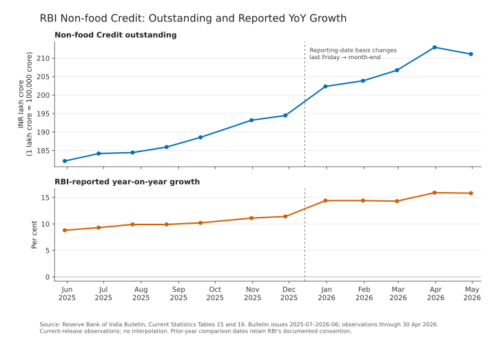

# IndiaMacro

IndiaMacro is a focused, auditable data-access library for official Indian
macroeconomic data. Version 0.2.0 is available as a GitHub release and covers
one dataset: RBI Sectoral Deployment of Bank Credit from RBI Bulletin Current
Statistics Tables 15 and 16.

Verified historical support currently covers the 12 Bulletin issues from July
2025 through June 2026. This is a tested IndiaMacro boundary, not the full
availability of RBI data.

## Built during OpenAI Build Week

IndiaMacro existed before Build Week as v0.1.0: a current-only RBI connector
with the June 2026 parser, cache, provenance, and offline replay. During Build
Week, v0.2.0 added the verified July 2025–June 2026 historical path, strict
layout-transition parsers, published vintages, explicit resolution, optional
plotting, portable CI, and a reproducible demonstration.

Codex accelerated source investigation, parser and test implementation,
compatibility analysis, caching, the historical API, packaging, and release
validation. The user set the scope and methodology: infrastructure before a
dashboard, one deeply verified dataset, strict contracts instead of silent
adaptation, explicit vintage handling, and bounded 16 GB local execution. The
primary model used for this work was GPT-5.6 Sol with extra-high reasoning.

### Judge quick start

Install the exact released wheel rather than a package with the same name from
another index:

```bash
python -m venv .venv
source .venv/bin/activate
python -m pip install "https://github.com/fotogfreaksandeep-arch/IndiaMacro/releases/download/v0.2.0/indiamacro-0.2.0-py3-none-any.whl"
```

Then run:

```python
from indiamacro import rbi

history = rbi.sectoral_credit_history(
    start_issue="2025-07",
    end_issue="2026-06",
)

points = history.select(
    series_id="RBI.SECTION42.NON_FOOD_CREDIT.OUTSTANDING",
    view="current",
)

print(len(history.vintages), len(history.current_observations), len(points))
```

The first live run requires access to public RBI pages and populates a
validated cache. Subsequent runs can replay the same source material without a
network session by passing `offline=True`.

## Install v0.2.0

Version 0.2.0 has not been published to PyPI. Install the exact wheel from the
public GitHub release:

IndiaMacro supports Python 3.11 and 3.12. Its portable CI suite runs on Ubuntu,
and the release demonstration has also been validated on macOS Apple silicon.
The released wheel is pure Python (`py3-none-any`) and has no platform-specific
compiled extension.

Create and activate an isolated environment on macOS or Linux:

```bash
python -m venv .venv
source .venv/bin/activate
```

On Windows PowerShell:

```powershell
python -m venv .venv
.\.venv\Scripts\Activate.ps1
```

Then install the released wheel:

```bash
python -m pip install "https://github.com/fotogfreaksandeep-arch/IndiaMacro/releases/download/v0.2.0/indiamacro-0.2.0-py3-none-any.whl"
```

Matplotlib remains optional:

```bash
python -m pip install "indiamacro[plot] @ https://github.com/fotogfreaksandeep-arch/IndiaMacro/releases/download/v0.2.0/indiamacro-0.2.0-py3-none-any.whl"
```

Development installs from a source checkout remain available:

```bash
python -m pip install .
python -m pip install ".[plot]"
```

Do not use `pip install indiamacro` to judge v0.2.0: this version is distributed
through the GitHub release and has not been published to PyPI.

## Test a source checkout

Install the development dependencies and run the portable validation layer:

```bash
python -m pip install -e ".[test,plot,build]"
ruff check .
pytest -m "not local_evidence and not live" -rs
python -m build
python -m twine check dist/*
```

The portable suite runs serially, makes no live RBI requests, and does not
depend on ignored local evidence. Maintainers who have the preserved RBI
acceptance evidence can additionally run:

```bash
pytest -m local_evidence -rs
```

Live RBI acceptance remains explicitly opt-in and is excluded from ordinary
tests and CI:

```bash
pytest -m live -rs
```

See [Testing IndiaMacro](docs/testing.md) for the purpose and evidence
requirements of each test layer.

## Retrieve current data

```python
from indiamacro import rbi

credit = rbi.sectoral_credit()

print(credit.observations.head())
print(credit.metadata.latest_observation_date)
print(credit.metadata.freshness_status)
print(credit.metadata.semantic_observations_sha256)
```

The result exposes a long-form pandas DataFrame as `credit.observations`, typed
release and provenance metadata as `credit.metadata`, and the two complete RBI
methodology notes as `credit.notes`.

The Bulletin can lag RBI's dedicated monthly Sectoral Deployment release.
`latest_observation_date` is the latest date represented by the returned data,
while `freshness_status` reports the comparison with the dedicated release
index. IndiaMacro never requests the dedicated release's blocked XLSX file.

## Verified publication history

The historical connector covers the 12 verified RBI Bulletin issues from July
2025 through June 2026, inclusively:

```python
from indiamacro import rbi

history = rbi.sectoral_credit_history(
    start_issue="2025-07",
    end_issue="2026-06",
)

vintages = history.vintages
current = history.current_observations

non_food = history.select(
    series_id="RBI.SECTION42.NON_FOOD_CREDIT.OUTSTANDING",
    view="current",
)
non_food_yoy = history.select(
    series_id="RBI.SECTION42.NON_FOOD_CREDIT.YOY_GROWTH_REPORTED",
    view="current",
)
resolved = history.resolve(policy="latest_publication", as_of="2026-04-30")
```

Historical collections are immutable tuples of frozen records with `Decimal`
values; selection and resolution do not return pandas objects. The complete
range contains 5,950 published-vintage observations and 3,060 current
observations. Each Non-food Credit selection above yields 12 chart-ready
points. The January-to-February 2026 boundary changes the current-date basis
from the last reporting Friday to calendar month-end, so a continuous
publication sequence does not imply unchanged methodology.

See the [historical API guide](docs/usage/rbi_sectoral_credit_history.md) for
cache, offline replay, hash, resolution, and exception details.



Plotting is an optional downstream demonstration:

```bash
python -m pip install ".[plot]"
python scripts/plot_rbi_sectoral_credit_history.py --offline
```

The [end-to-end tutorial](docs/tutorials/rbi_sectoral_credit_end_to_end.md)
walks through live retrieval, offline replay, selection, explicit resolution,
CSV export, chart generation, and provenance inspection. IndiaMacro's core
purpose remains auditable data access; the chart demonstrates what trustworthy
downstream applications can build on that infrastructure.

## Refresh, offline use, and cache

```python
# Prefer a verified cache; retrieve live only when no compatible bundle exists.
credit = rbi.sectoral_credit()

# Force exact-title live discovery and bounded retrieval.
credit = rbi.sectoral_credit(refresh=True)

# Guarantee no network session is created.
credit = rbi.sectoral_credit(offline=True)

# Replay verified historical issues from their separate history cache.
history = rbi.sectoral_credit_history(
    "2025-07",
    "2026-06",
    offline=True,
)
```

An explicit `cache_dir` may be passed to any call. Otherwise
`INDIAMACRO_CACHE_DIR` is used when set, followed by the platform-standard user
cache directory. Raw HTML pages and a versioned manifest are committed only
after both tables validate and parse. Every cache read recalculates raw and
output hashes. Missing, incompatible, or corrupt caches raise specific errors;
the API never returns an empty DataFrame as an error substitute.

Pre-release manifest schema 1 bundles used the misleading field
`normalized_output_sha256`. v0.1.0 classifies those bundles as incompatible.
Run an online call to create a schema 2 bundle, or remove the obsolete bundle.
Immutable old bundles are not rewritten.

## Data and provenance identities

IndiaMacro distinguishes three hash concepts:

- `major_sectors_sha256` and `industries_sha256` identify the exact raw HTML
  bytes. RBI page-chrome changes therefore change these hashes.
- `semantic_observations_sha256` identifies sorted normalized economic data
  and classifications, excluding transport and implementation provenance. It
  remains stable across page-chrome, source-URL, DataFrame-index, and row-order
  changes.
- `provenance_bound_output_sha256` identifies the complete canonical output,
  including source URLs, raw source hashes, parser version, and layout ID. It
  changes when either the economic data or provenance changes.

The exact columns and serialization rules are documented in
[`docs/contracts/rbi_sectoral_credit_bulletin_v1.md`](docs/contracts/rbi_sectoral_credit_bulletin_v1.md).

## Vintages and explicit resolution

`history.vintages` retains every published value and reference observation;
repeated publications and later revisions remain separate. The
`history.current_observations` view contains each release's current outstanding
value and RBI-reported growth measures. Neither collection silently chooses a
latest value.

Use `history.resolve(policy="latest_publication")` when a resolved view is
explicitly required. Its optional `as_of="YYYY-MM-DD"` cutoff excludes later
publications while retaining the selected publication and provenance.

## Current limitations

The current connector supports its strict v1 layout. Historical support begins
with the July 2025 Bulletin and ends with the June 2026 Bulletin. Those are
verified support boundaries, not the full availability of sectoral-credit data
from RBI. IndiaMacro does not yet provide other RBI datasets, DBIE integration,
automatic future-layout adaptation, dashboards, forecasting, or a general
Indian macro-data platform. Version 0.2.0 is not yet published to PyPI.

IndiaMacro is licensed under the [MIT License](LICENSE).
